# [📈 Live Status](https://beamable.github.io/status): <!--live status--> **🟩 All systems operational**

This repository contains the open-source uptime monitor and status page for [Beamable](https://www.beamable.com/), powered by [Upptime](https://github.com/upptime/upptime).

With [Upptime](https://upptime.js.org), you can get your own unlimited and free uptime monitor and status page, powered entirely by a GitHub repository. We use [Issues](https://github.com/beamable/status/issues) as incident reports, [Actions](https://github.com/beamable/status/actions) as uptime monitors, and [Pages](https://beamable.github.io/status) for the status page.

<!--start: status pages-->
<!-- This summary is generated by Upptime (https://github.com/upptime/upptime) -->
<!-- Do not edit this manually, your changes will be overwritten -->
<!-- prettier-ignore -->
| URL | Status | History | Response Time | Uptime |
| --- | ------ | ------- | ------------- | ------ |
|  [Beamable Auth (Basic)](https://api.beamable.com/basic/auth/platform/docs) | 🟩 Up | [beamable-auth-basic.yml](https://github.com/beamable/status/commits/HEAD/history/beamable-auth-basic.yml) | 

 73ms
     
 | 

<a href="https://beamable.github.io/status/history/beamable-auth-basic">100.00%</a>
    

|  [Beamable Content (Basic)](https://api.beamable.com/basic/content/platform/docs) | 🟩 Up | [beamable-content-basic.yml](https://github.com/beamable/status/commits/HEAD/history/beamable-content-basic.yml) | 

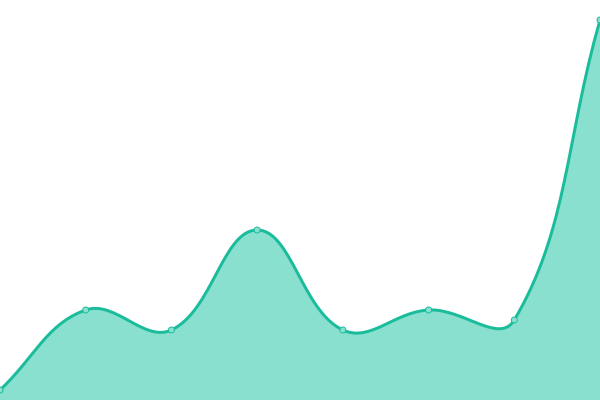 366ms
     
 | 

<a href="https://beamable.github.io/status/history/beamable-content-basic">100.00%</a>
    

|  [Beamable Accounts (Basic)](https://api.beamable.com/basic/accounts/platform/docs) | 🟩 Up | [beamable-accounts-basic.yml](https://github.com/beamable/status/commits/HEAD/history/beamable-accounts-basic.yml) | 

 10ms
     
 | 

<a href="https://beamable.github.io/status/history/beamable-accounts-basic">100.00%</a>
    

|  [Beamable Accounts (Object)](https://api.beamable.com/object/accounts/platform/docs) | 🟩 Up | [beamable-accounts-object.yml](https://github.com/beamable/status/commits/HEAD/history/beamable-accounts-object.yml) | 

 6ms
     
 | 

<a href="https://beamable.github.io/status/history/beamable-accounts-object">100.00%</a>
    

|  [Beamable Inventory (Basic)](https://api.beamable.com/basic/inventory/platform/docs) | 🟩 Up | [beamable-inventory-basic.yml](https://github.com/beamable/status/commits/HEAD/history/beamable-inventory-basic.yml) | 

 88ms
     
 | 

<a href="https://beamable.github.io/status/history/beamable-inventory-basic">100.00%</a>
    

|  [Beamable Inventory (Object)](https://api.beamable.com/object/inventory/platform/docs) | 🟩 Up | [beamable-inventory-object.yml](https://github.com/beamable/status/commits/HEAD/history/beamable-inventory-object.yml) | 

 18ms
     
 | 

<a href="https://beamable.github.io/status/history/beamable-inventory-object">100.00%</a>
    

|  [Beamable Stats (Basic)](https://api.beamable.com/basic/stats/platform/docs) | 🟩 Up | [beamable-stats-basic.yml](https://github.com/beamable/status/commits/HEAD/history/beamable-stats-basic.yml) | 

 10ms
     
 | 

<a href="https://beamable.github.io/status/history/beamable-stats-basic">100.00%</a>
    

|  [Beamable Stats (Object)](https://api.beamable.com/object/stats/platform/docs) | 🟩 Up | [beamable-stats-object.yml](https://github.com/beamable/status/commits/HEAD/history/beamable-stats-object.yml) | 

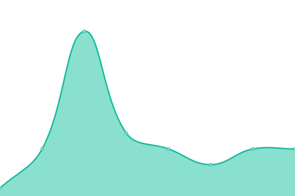 1121ms
     
 | 

<a href="https://beamable.github.io/status/history/beamable-stats-object">100.00%</a>
    

|  [Beamable Leaderboards (Basic)](https://api.beamable.com/basic/leaderboards/platform/docs) | 🟩 Up | [beamable-leaderboards-basic.yml](https://github.com/beamable/status/commits/HEAD/history/beamable-leaderboards-basic.yml) | 

 268ms
     
 | 

<a href="https://beamable.github.io/status/history/beamable-leaderboards-basic">100.00%</a>
    

|  [Beamable Leaderboards (Object)](https://api.beamable.com/object/leaderboards/platform/docs) | 🟩 Up | [beamable-leaderboards-object.yml](https://github.com/beamable/status/commits/HEAD/history/beamable-leaderboards-object.yml) | 

 8ms
     
 | 

<a href="https://beamable.github.io/status/history/beamable-leaderboards-object">100.00%</a>
    

|  [Beamable Tournaments (Basic)](https://api.beamable.com/basic/tournaments/platform/docs) | 🟩 Up | [beamable-tournaments-basic.yml](https://github.com/beamable/status/commits/HEAD/history/beamable-tournaments-basic.yml) | 

 247ms
     
 | 

<a href="https://beamable.github.io/status/history/beamable-tournaments-basic">100.00%</a>
    

|  [Beamable Tournaments (Object)](https://api.beamable.com/object/tournaments/platform/docs) | 🟩 Up | [beamable-tournaments-object.yml](https://github.com/beamable/status/commits/HEAD/history/beamable-tournaments-object.yml) | 

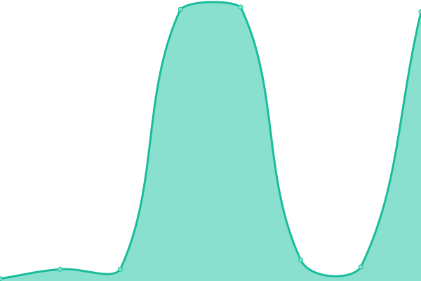 213ms
     
 | 

<a href="https://beamable.github.io/status/history/beamable-tournaments-object">100.00%</a>
    

|  [Beamable Payments (Basic)](https://api.beamable.com/basic/payments/platform/docs) | 🟩 Up | [beamable-payments-basic.yml](https://github.com/beamable/status/commits/HEAD/history/beamable-payments-basic.yml) | 

 26ms
     
 | 

<a href="https://beamable.github.io/status/history/beamable-payments-basic">100.00%</a>
    

|  [Beamable Payments (Object)](https://api.beamable.com/object/payments/platform/docs) | 🟩 Up | [beamable-payments-object.yml](https://github.com/beamable/status/commits/HEAD/history/beamable-payments-object.yml) | 

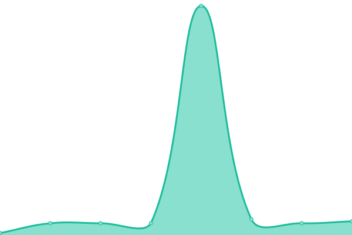 169ms
     
 | 

<a href="https://beamable.github.io/status/history/beamable-payments-object">100.00%</a>
    

|  [Beamable Commerce (Basic)](https://api.beamable.com/basic/commerce/platform/docs) | 🟩 Up | [beamable-commerce-basic.yml](https://github.com/beamable/status/commits/HEAD/history/beamable-commerce-basic.yml) | 

 8ms
     
 | 

<a href="https://beamable.github.io/status/history/beamable-commerce-basic">100.00%</a>
    

|  [Beamable Commerce (Object)](https://api.beamable.com/object/commerce/platform/docs) | 🟩 Up | [beamable-commerce-object.yml](https://github.com/beamable/status/commits/HEAD/history/beamable-commerce-object.yml) | 

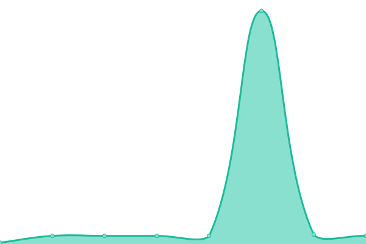 9ms
     
 | 

<a href="https://beamable.github.io/status/history/beamable-commerce-object">100.00%</a>
    

|  [Beamable Announcements (Basic)](https://api.beamable.com/basic/announcements/platform/docs) | 🟩 Up | [beamable-announcements-basic.yml](https://github.com/beamable/status/commits/HEAD/history/beamable-announcements-basic.yml) | 

 23ms
     
 | 

<a href="https://beamable.github.io/status/history/beamable-announcements-basic">100.00%</a>
    

|  [Beamable Announcements (Object)](https://api.beamable.com/object/announcements/platform/docs) | 🟩 Up | [beamable-announcements-object.yml](https://github.com/beamable/status/commits/HEAD/history/beamable-announcements-object.yml) | 

 6ms
     
 | 

<a href="https://beamable.github.io/status/history/beamable-announcements-object">100.00%</a>
    

|  [Beamable Mail (Basic)](https://api.beamable.com/basic/mail/platform/docs) | 🟩 Up | [beamable-mail-basic.yml](https://github.com/beamable/status/commits/HEAD/history/beamable-mail-basic.yml) | 

 7ms
     
 | 

<a href="https://beamable.github.io/status/history/beamable-mail-basic">100.00%</a>
    

|  [Beamable Mail (Object)](https://api.beamable.com/object/mail/platform/docs) | 🟩 Up | [beamable-mail-object.yml](https://github.com/beamable/status/commits/HEAD/history/beamable-mail-object.yml) | 

 8ms
     
 | 

<a href="https://beamable.github.io/status/history/beamable-mail-object">100.00%</a>
    

|  [Beamable Beamo (Basic)](https://api.beamable.com/basic/beamo/platform/docs) | 🟩 Up | [beamable-beamo-basic.yml](https://github.com/beamable/status/commits/HEAD/history/beamable-beamo-basic.yml) | 

 12ms
     
 | 

<a href="https://beamable.github.io/status/history/beamable-beamo-basic">100.00%</a>
    

|  [Beamable Cloud Saving (Basic)](https://api.beamable.com/basic/cloudsaving/platform/docs) | 🟩 Up | [beamable-cloud-saving-basic.yml](https://github.com/beamable/status/commits/HEAD/history/beamable-cloud-saving-basic.yml) | 

 7ms
     
 | 

<a href="https://beamable.github.io/status/history/beamable-cloud-saving-basic">100.00%</a>
    

|  [Beamable Notification (Basic)](https://api.beamable.com/basic/notification/platform/docs) | 🟩 Up | [beamable-notification-basic.yml](https://github.com/beamable/status/commits/HEAD/history/beamable-notification-basic.yml) | 

 8ms
     
 | 

<a href="https://beamable.github.io/status/history/beamable-notification-basic">100.00%</a>
    

|  [Beamable Push (Basic)](https://api.beamable.com/basic/push/platform/docs) | 🟩 Up | [beamable-push-basic.yml](https://github.com/beamable/status/commits/HEAD/history/beamable-push-basic.yml) | 

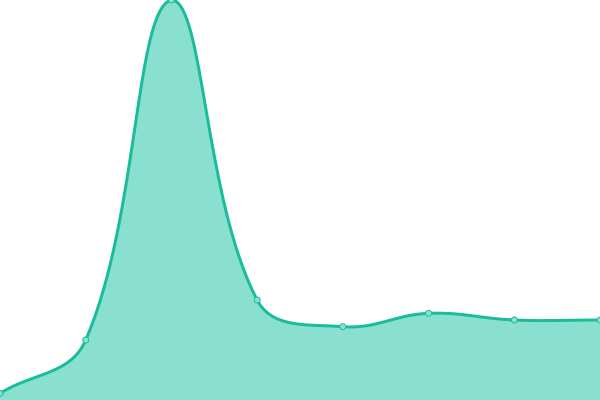 11ms
     
 | 

<a href="https://beamable.github.io/status/history/beamable-push-basic">100.00%</a>
    

|  [Beamable Session (Basic)](https://api.beamable.com/basic/session/platform/docs) | 🟩 Up | [beamable-session-basic.yml](https://github.com/beamable/status/commits/HEAD/history/beamable-session-basic.yml) | 

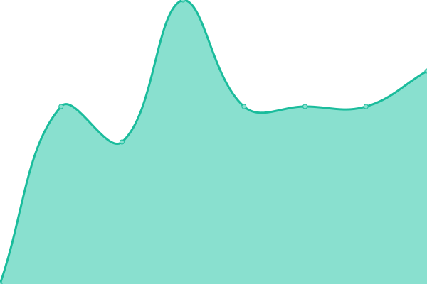 6ms
     
 | 

<a href="https://beamable.github.io/status/history/beamable-session-basic">100.00%</a>
    

|  [Beamable Realms (Basic)](https://api.beamable.com/basic/realms/platform/docs) | 🟩 Up | [beamable-realms-basic.yml](https://github.com/beamable/status/commits/HEAD/history/beamable-realms-basic.yml) | 

 7ms
     
 | 

<a href="https://beamable.github.io/status/history/beamable-realms-basic">100.00%</a>
    

|  [Beamable Social (Basic)](https://api.beamable.com/basic/social/platform/docs) | 🟩 Up | [beamable-social-basic.yml](https://github.com/beamable/status/commits/HEAD/history/beamable-social-basic.yml) | 

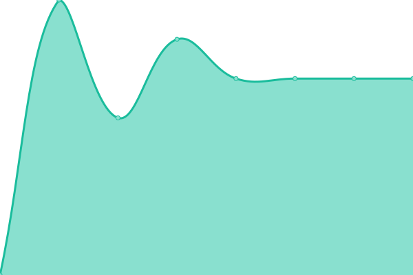 9ms
     
 | 

<a href="https://beamable.github.io/status/history/beamable-social-basic">100.00%</a>
    

|  [Beamable Trials (Basic)](https://api.beamable.com/basic/trials/platform/docs) | 🟩 Up | [beamable-trials-basic.yml](https://github.com/beamable/status/commits/HEAD/history/beamable-trials-basic.yml) | 

 61ms
     
 | 

<a href="https://beamable.github.io/status/history/beamable-trials-basic">100.00%</a>
    

|  [Beamable Calendars (Basic)](https://api.beamable.com/object/calendars/platform/docs) | 🟩 Up | [beamable-calendars-basic.yml](https://github.com/beamable/status/commits/HEAD/history/beamable-calendars-basic.yml) | 

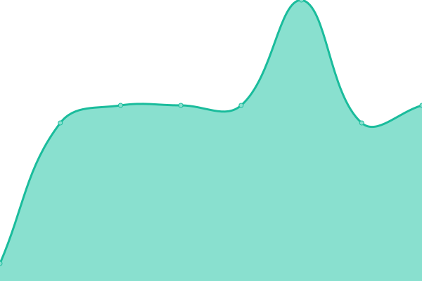 27ms
     
 | 

<a href="https://beamable.github.io/status/history/beamable-calendars-basic">100.00%</a>
    

|  [Beamable Event Players (Object)](https://api.beamable.com/object/event-players/platform/docs) | 🟩 Up | [beamable-event-players-object.yml](https://github.com/beamable/status/commits/HEAD/history/beamable-event-players-object.yml) | 

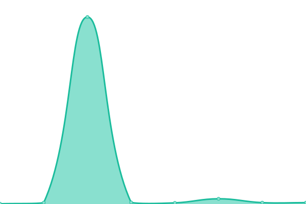 158ms
     
 | 

<a href="https://beamable.github.io/status/history/beamable-event-players-object">100.00%</a>
    

|  [Beamable Events (Basic)](https://api.beamable.com/basic/events/platform/docs) | 🟩 Up | [beamable-events-basic.yml](https://github.com/beamable/status/commits/HEAD/history/beamable-events-basic.yml) | 

 8ms
     
 | 

<a href="https://beamable.github.io/status/history/beamable-events-basic">100.00%</a>
    

|  [Beamable Events (Object)](https://api.beamable.com/object/events/platform/docs) | 🟩 Up | [beamable-events-object.yml](https://github.com/beamable/status/commits/HEAD/history/beamable-events-object.yml) | 

 22ms
     
 | 

<a href="https://beamable.github.io/status/history/beamable-events-object">100.00%</a>
    

|  [Beamable Groups (Object)](https://api.beamable.com/object/groups/platform/docs) | 🟩 Up | [beamable-groups-object.yml](https://github.com/beamable/status/commits/HEAD/history/beamable-groups-object.yml) | 

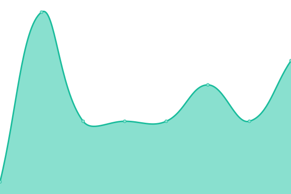 8ms
     
 | 

<a href="https://beamable.github.io/status/history/beamable-groups-object">100.00%</a>
    

|  [Beamable Group Users (Object)](https://api.beamable.com/object/group-users/platform/docs) | 🟩 Up | [beamable-group-users-object.yml](https://github.com/beamable/status/commits/HEAD/history/beamable-group-users-object.yml) | 

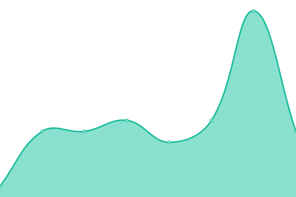 602ms
     
 | 

<a href="https://beamable.github.io/status/history/beamable-group-users-object">100.00%</a>
    

|  [Beamable Proto Actor Stack](https://api.beamable.com/api/health) | 🟩 Up | [beamable-proto-actor-stack.yml](https://github.com/beamable/status/commits/HEAD/history/beamable-proto-actor-stack.yml) | 

 1ms
     
 | 

<a href="https://beamable.github.io/status/history/beamable-proto-actor-stack">100.00%</a>
    

|  [Beamable Portal](https://portal.beamable.com/) | 🟩 Up | [beamable-portal.yml](https://github.com/beamable/status/commits/HEAD/history/beamable-portal.yml) | 

 89ms
     
 | 

<a href="https://beamable.github.io/status/history/beamable-portal">100.00%</a>
    

<!--end: status pages-->

[**Visit our status website →**](https://beamable.github.io/status)

## 📄 License

- Powered by: [Upptime](https://github.com/upptime/upptime)
- Code: [MIT](./LICENSE) © [Anand Chowdhary](https://anandchowdhary.com), supported by [Pabio](https://pabio.com)
- Data in the `./history` directory: [Open Database License](https://opendatacommons.org/licenses/odbl/1-0/)
