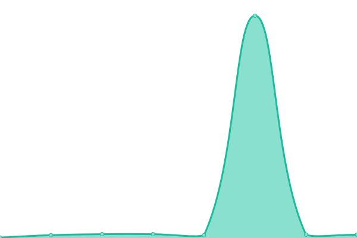
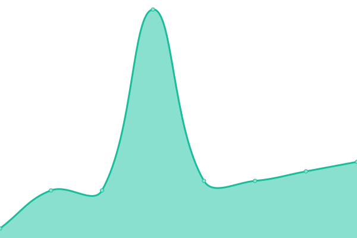
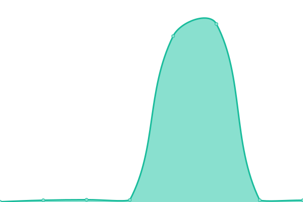

# [📈 Live Status](https://beamable.github.io/status): <!--live status--> **🟩 All systems operational**

This repository contains the open-source uptime monitor and status page for [Beamable](https://www.beamable.com/), powered by [Upptime](https://github.com/upptime/upptime).

With [Upptime](https://upptime.js.org), you can get your own unlimited and free uptime monitor and status page, powered entirely by a GitHub repository. We use [Issues](https://github.com/beamable/status/issues) as incident reports, [Actions](https://github.com/beamable/status/actions) as uptime monitors, and [Pages](https://beamable.github.io/status) for the status page.

<!--start: status pages-->
<!-- This summary is generated by Upptime (https://github.com/upptime/upptime) -->
<!-- Do not edit this manually, your changes will be overwritten -->
<!-- prettier-ignore -->
| URL | Status | History | Response Time | Uptime |
| --- | ------ | ------- | ------------- | ------ |
|  [Beamable Auth (Basic)](https://api.beamable.com/basic/auth/platform/docs) | 🟩 Up | [beamable-auth-basic.yml](https://github.com/beamable/status/commits/HEAD/history/beamable-auth-basic.yml) | 

 913ms
     
 | 

<a href="https://beamable.github.io/status/history/beamable-auth-basic">100.00%</a>
    

|  [Beamable Accounts (Basic)](https://api.beamable.com/basic/accounts/platform/docs) | 🟩 Up | [beamable-accounts-basic.yml](https://github.com/beamable/status/commits/HEAD/history/beamable-accounts-basic.yml) | 

 909ms
     
 | 

<a href="https://beamable.github.io/status/history/beamable-accounts-basic">100.00%</a>
    

|  [Beamable Accounts (Object)](https://api.beamable.com/object/accounts/platform/docs) | 🟩 Up | [beamable-accounts-object.yml](https://github.com/beamable/status/commits/HEAD/history/beamable-accounts-object.yml) | 

 71ms
     
 | 

<a href="https://beamable.github.io/status/history/beamable-accounts-object">100.00%</a>
    

|  [Beamable Inventory (Basic)](https://api.beamable.com/basic/inventory/platform/docs) | 🟩 Up | [beamable-inventory-basic.yml](https://github.com/beamable/status/commits/HEAD/history/beamable-inventory-basic.yml) | 

 244ms
     
 | 

<a href="https://beamable.github.io/status/history/beamable-inventory-basic">100.00%</a>
    

|  [Beamable Inventory (Object)](https://api.beamable.com/object/inventory/platform/docs) | 🟩 Up | [beamable-inventory-object.yml](https://github.com/beamable/status/commits/HEAD/history/beamable-inventory-object.yml) | 

 141ms
     
 | 

<a href="https://beamable.github.io/status/history/beamable-inventory-object">100.00%</a>
    

|  [Beamable Stats (Basic)](https://api.beamable.com/basic/stats/platform/docs) | 🟩 Up | [beamable-stats-basic.yml](https://github.com/beamable/status/commits/HEAD/history/beamable-stats-basic.yml) | 

 704ms
     
 | 

<a href="https://beamable.github.io/status/history/beamable-stats-basic">100.00%</a>
    

|  [Beamable Stats (Object)](https://api.beamable.com/object/stats/platform/docs) | 🟩 Up | [beamable-stats-object.yml](https://github.com/beamable/status/commits/HEAD/history/beamable-stats-object.yml) | 

 321ms
     
 | 

<a href="https://beamable.github.io/status/history/beamable-stats-object">100.00%</a>
    

|  [Beamable Beamo (Basic)](https://api.beamable.com/basic/beamo/platform/docs) | 🟩 Up | [beamable-beamo-basic.yml](https://github.com/beamable/status/commits/HEAD/history/beamable-beamo-basic.yml) | 

 1138ms
     
 | 

<a href="https://beamable.github.io/status/history/beamable-beamo-basic">100.00%</a>
    

|  [Beamable Event Players (Object)](https://api.beamable.com/object/event-players/platform/docs) | 🟩 Up | [beamable-event-players-object.yml](https://github.com/beamable/status/commits/HEAD/history/beamable-event-players-object.yml) | 

 1550ms
     
 | 

<a href="https://beamable.github.io/status/history/beamable-event-players-object">100.00%</a>
    

|  [Beamable Events (Basic)](https://api.beamable.com/basic/events/platform/docs) | 🟩 Up | [beamable-events-basic.yml](https://github.com/beamable/status/commits/HEAD/history/beamable-events-basic.yml) | 

 98ms
     
 | 

<a href="https://beamable.github.io/status/history/beamable-events-basic">100.00%</a>
    

|  [Beamable Events (Object)](https://api.beamable.com/object/events/platform/docs) | 🟩 Up | [beamable-events-object.yml](https://github.com/beamable/status/commits/HEAD/history/beamable-events-object.yml) | 

 98ms
     
 | 

<a href="https://beamable.github.io/status/history/beamable-events-object">100.00%</a>
    

<!--end: status pages-->

[**Visit our status website →**](https://beamable.github.io/status)

## 📄 License

- Powered by: [Upptime](https://github.com/upptime/upptime)
- Code: [MIT](./LICENSE) © [Anand Chowdhary](https://anandchowdhary.com), supported by [Pabio](https://pabio.com)
- Data in the `./history` directory: [Open Database License](https://opendatacommons.org/licenses/odbl/1-0/)
